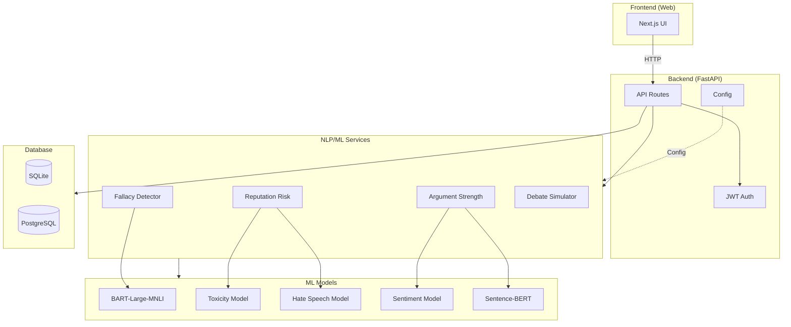

<h1 align="center"> 🛡️ AI-Argument Simulator With Risk Forecasting</h1>


> <p align="center">🚀 <strong>An AI-powered debate training and communication risk analysis platform. <b>LogicShield</b> strengthens your arguments, detects logical fallacies, and evaluates reputational risk before you publish, pitch, or perform.</strong></p>

<div align="center">

<a href="https://logic-shield.vercel.app/" target="_blank">
  
</a>


</div>


## ✨ Features

LogicShield combines adversarial argument simulation with structured NLP analysis to help users improve both logic and long-term communication safety.

* 🧠 **AI Debate Simulation** – Real-time adversarial opponent with selectable personas (logical, aggressive, skeptical, devil's advocate).
* ⚡ **Real-Time Argument Coach** – Live coaching as you type with instant feedback on fallacies and suggestions.
* ⚖️ **Logical Fallacy Detection** – Automatically identifies common fallacies using transformer-based ML models (ad hominem, strawman, false dilemma, slippery slope, bandwagon).
* 📊 **Argument Strength Scoring** – Quantifies coherence, evidence support, sentiment, and logical structure with score penalties for issues.
* 🛡️ **Reputation Risk Estimation** – Flags extreme phrasing, moral polarity, identity-sensitive language using toxicity and hate speech detection.
* 📈 **Progress Analytics Dashboard** – Track improvement across debate sessions.
* 🎯 **Smart Counter-Arguments** – AI-powered responses that analyze user arguments and provide relevant rebuttals.
* 📱 **Demo Mode** – Try the platform without authentication with simulated AI responses.
* 🔐 **Authentication** – Secure JWT-based authentication for personalized experience.

## 🎯 Use Cases

* 🎓 Students preparing for debates
* ⚖️ Law aspirants & legal professionals
* 🎤 Public speakers & podcasters
* 🏢 Executives preparing presentations
* 📢 Political commentators
* 📧 Communications professionals (emails, proposals)
* 👥 Debate club members
* 💼 Anyone wanting to improve argumentation skills

---

## ⚙️ Platform Support

<table border="1" cellpadding="10" cellspacing="0">
  <thead>
    <tr>
      <th>Platform</th>
      <th>Minimum Requirements</th>
      <th>Supported?</th>
    </tr>
  </thead>
  <tbody>
    <tr>
      <td>Web Application (Fully Responsive)</td>
      <td>Modern Browser (Chrome, Brave, Edge, Firefox, etc)</td>
      <td>✅</td>
    </tr>
  </tbody>
</table>


## 🛠️ Tech Stack

### Frontend

* Next.js 14
* React 18
* Tailwind CSS
* TypeScript

### Backend

* **Framework**: FastAPI (Python)
* **ORM**: SQLAlchemy 2.0
* **Database**: SQLite (dev) / PostgreSQL (prod)
* **Authentication**: JWT with python-jose

#### Backend Configuration

Copy `.env.template` to `.env` and configure:

| Variable | Description | Default |
|----------|-------------|---------|
| `DATABASE_URL` | Database connection URL | `sqlite:///./logicshield.db` |
| `USE_SQLITE` | Use SQLite (true/false) | `true` |
| `SECRET_KEY` | Secret key for JWT | (auto-generated) |
| `HF_TOKEN` | Hugging Face token | (optional) |
| `PORT` | Server port | `8000` |
| `DEBUG` | Debug mode | `true` |
| `DEMO_MODE` | Demo mode (simulated AI) | `true` (for new clones) |

#### Demo Mode

The backend has **Demo Mode** for quick testing. When enabled:
- Uses simulated/smart-template responses
- No ML model downloads needed (~4GB)
- Works out of the box for new cloners

```bash
# For full ML models locally, set in .env:
DEMO_MODE=false

# And install full dependencies:
pip install -r requirements-local.txt
```

### NLP & ML

* **Demo Mode (default)**: Smart templates + keyword detection - works without ML packages
* **Full ML** (optional):
  * **Deep Learning**: PyTorch 2.1+
  * **Transformers**: Hugging Face Transformers
    * `facebook/bart-large-mnli` - Fallacy detection
    * `martin-ha/toxic-comment-model` - Toxicity detection
    * `facebook/roberta-hate-speech-dynabench-r4-target` - Hate speech detection
    * `distilbert-base-uncased-finetuned-sst-2-english` - Sentiment analysis
  * **Embeddings**: Sentence-BERT (`sentence-transformers/all-MiniLM-L6-v2`)
  * **ML**: scikit-learn
* **LLM for Counter-Arguments**: Meta Llama 3.2 1B (`meta-llama/Llama-3.2-1B-Instruct`) via HuggingFace Inference Providers - Generates intelligent, persona-aware responses

---

## 🚀 Getting Started

### 1️⃣ Clone the Repository

```bash
git clone https://github.com/saad2134/logic-shield.git
cd logic-shield
```

### 2️⃣ Backend Setup

```bash
cd backend

# Create virtual environment (optional but recommended)
python -m venv venv
source venv/bin/activate  # Linux/Mac
# or: venv\Scripts\activate  # Windows

# Install dependencies
pip install -r requirements.txt

# Copy environment template and configure
cp .env.template .env

# Run the server (Demo Mode - works out of the box)
uvicorn main:app --reload
```

The API will be available at `http://localhost:8000`
- API Docs: `http://localhost:8000/docs`
- ReDoc: `http://localhost:8000/redoc`

### (Optional) Enable Full ML Models

By default, the backend runs in Demo Mode with simulated responses. For full ML:

```bash
# Install full dependencies
pip install -r requirements-local.txt

# Enable in .env:
DEMO_MODE=false
```

### 3️⃣ Frontend Setup

```bash
cd web
npm install
npm run dev
```

Open `http://localhost:3000`

---

## 📁 Folder Structure

```
logic-shield/
│
├── web/                 # Next.js frontend
├── backend/             # FastAPI backend
│   ├── app/            # Application config
│   ├── api/            # API routes & schemas
│   ├── database/       # Database models & connection
│   ├── services/       # NLP/ML services
│   ├── main.py         # Application entry point
│   ├── requirements.txt
│   └── .env.template   # Environment variables template
│
└── docs/               # Documentation
```

---

## 🏛️ Project Architecture



*See `docs/BACKEND.md` for detailed architecture documentation.*

---

## 📱 Screenshots

*Coming Soon*

---

## 📊 Project Stats

<div align="center">


</div>


## ⭐ Star History

<a href="https://www.star-history.com/#saad2134/logic-shield&Date">
 <picture>
   <source media="(prefers-color-scheme: dark)" srcset="https://api.star-history.com/svg?repos=saad2134/logic-shield&type=Date&theme=dark" />
   <source media="(prefers-color-scheme: light)" srcset="https://api.star-history.com/svg?repos=saad2134/logic-shield&type=Date" />
   
 </picture>
</a>


---

## 🔐 Disclaimer

LogicShield provides probabilistic analysis based on NLP models.
It does not guarantee real-world outcomes or predict future controversy with certainty.


## ✍️ Endnote

<p align="center">⭐ Star this repository if you find it useful. Build stronger arguments. Communicate responsibly.</p>

---

## 🏷 Tags

`nlp` `natural-language-processing` `transformers` `bert` `llm` `large-language-models` `argument-mining` `computational-argumentation` `logical-fallacy-detection` `fallacy-classification` `debate-ai` `debate-training` `argument-analysis` `critical-thinking` `reasoning-ai` `semantic-embeddings` `sentence-bert` `text-classification` `ai-webapp` `fastapi` `nextjs` `react` `machine-learning` `deep-learning` `reputation-analysis` `communication-intelligence` `ai-simulation` `adversarial-ai` `persuasion-analysis` `explainable-ai` `data-driven-feedback` `education-tech` `edtech-ai` `logicshield`
